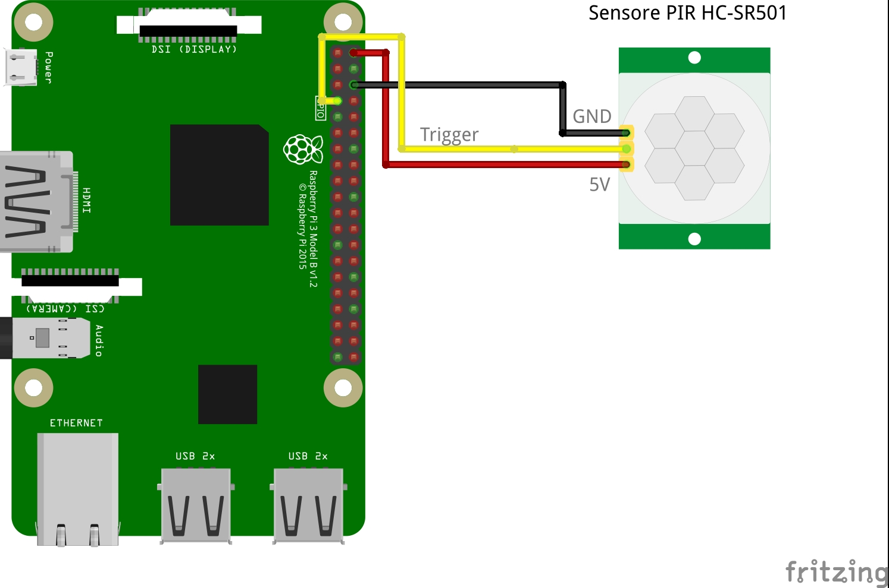

# HC-SR501 an GPIO4

Dieses Beispiel verwendet einen PIR Sensor vom TYP HC-SR501 um die Anwesenheit von Personen (Wärmequellen) festzustellen. Wird der GPIO-Pin ausgelöst soll eine entsprechende Notification verschickt werden.

Module in MagicMirror² verwenden Notifications um untereinander zu kommunizieren.

Neben [diesem Modul](https://github.com/Tom-Hirschberger/MMM-GPIO-Notifications) wird auch das Modul [MMM-Screen-Powersave-Notification](https://github.com/Tom-Hirschberger/MMM-Screen-Powersave-Notification) verwendet, dass die erzeugte Notification empfängt und daraufhin den Bildschirm-Timeout zurücksetzt.
Optional kann ein drittes Modul [MMM-ViewNotifications](https://github.com/glitch452/MMM-ViewNotifications) verwendet werden, um die gesendeten Notifications zu visualisieren.

**WICHTIG: Die Nummer des GPIO entspricht nicht der Pin-Nummer auf dem Raspberry Pi. GPIO4 entspricht z.B. Pin 7 auf dem Raspberry Pi 3 Board. Das Modul verwendet die Nummer des GPIO nicht die des Pin!**

Ich empfehle, die Installation über SSH vorzunehmen, da im Idealfall später der Monitor ja ausgeschaltet wird.


## Vorbereitung

Für das weitere Vorgehen muss auf dem System zwingend git installiert sein. Falls sie MagicMirror mit dem Original-Skript installiert haben ist dies definitv der Fall. Wenn nicht kann git mit folgenden Befehlen nachinstalliert werden:

```bash
sudo apt-get update
sudo apt-get install git
```

### HC-SR501

Neben dem eigentlichen Verbinden des Sensors mit dem Raspberry Pi muss zuvor der Sensor entsprechend eingestellt werden.
Der Sensor verfügt im Regelfall über zwei Potentiometer und einen Jumper.
Wir widmen uns erst dem Jumper. Dieser Regelt, ob, falls eine Person erkannt wurde nur ein Signal (der Modus den wir wollen) oder solange ein pulsierendes Signal gesendet wird, bis die Person den Sensorbereich verlässt. Hierzu müssen im Regelfall die beiden PINs die näher an der Sensormitte sind verbunden werden.

Das Potentiometer, welches weiter in der Mitte des Sensors ist regelt die Empfindlichkeit (kann je nach belieben gewählt werden), das andere die Haltezeit (die wir möglichst kurz sein solte). Wir drehen als das Potentiometer für die Haltezeit möglichst weit gegen den Uhrzeigersinn.


### Verkabelung

Der Sensor kann mit einer Spannung von 5V bis 20V (teilweise nur 12V) betrieben werden. Wir müssen also VCC, GND und die Signalleitung (Trigger) anbringen.

Ein entsprechendes Bild ist in diesem Ordner enthalten (HC-SR501-GPIO4.jpg).
VCC wird mit Pin 2, GND mit 6, Trigger mit 7 verbunden.

Bitte unbedingt darauf achten, dass die Leitung von Pin 2 mit dem "+" Pol und Pin 6 mit dem GND des Sensors verbunden wird. Andernfalls kann der Sensor zestört werden. Das Bild zeigt ein typisches Beispiel, bei manchen Sensoren sind die Pole vertauscht.




## Module installieren

### MMM-GPIO-Notifications

Nur Benutzer, die in der Gruppe "gpio" sind dürfen auf die GPIO-Pins zugreifen. Dies kann einfach auf der Konsole mittels des Befehls "groups" überprüft werden.

```bash
groups
```

Die Ausgabe sollte in etwa so aussehen und es muss "gpio" darin auftauchen.

```bash
pi adm dialout cdrom sudo audio video plugdev games users input netdev gpio i2c spi
```

Falls "gpio" nicht enthalten ist kann der User "pi" mit nachfolgendem Befehl in die Gruppe hinzugefügt werden. Um sicher zu gehen, dass die neuen Einstellungen auch wirksam sind sollte der Pi neu gestartet werden.

```bash
sudo usermod -a -G gpio pi
```

Danach kann das Modul installiert werden. Falls MagicMirror über das Installationsskript in den Default-Ordner installiert wurde, können die nächsten Befehle direkt verwendet werden. Die Installation kann einen Moment dauern, und es treten vermutlich Warnungen auf, die aber getrost ignoriert werden können.

```bash
cd ~/MagicMirror/modules
git clone https://github.com/Tom-Hirschberger/MMM-GPIO-Notifications.git
cd MMM-GPIO-Notifications
npm install
```

### MMM-Screen-Powersave-Notification

Wie auch beim vorherigen Modul können die Befehle direkt kopiert und ausgeführt werden, wenn MagicMirror im Default-Verzeichnis installiert wurde.

```bash
cd ~/MagicMirror/modules
git clone https://github.com/Tom-Hirschberger/MMM-Screen-Powersave-Notification.git
cd MMM-Screen-Powersave-Notification
npm install
```

Falls noch nicht bekannt ist, ob Ihr Monitor sich mittels HDMI ausschalten/einschalten lässt kann dies mit den nachfolgenden Befehlen überprüft werden. Die Befehle sollten über SSH ausgeführt werden, weil im Idealfall der Monitor zwischendurch ausgeschalten und 20 Sekunden später wieder angeschaltet wird.

```bash
/usr/bin/vcgencmd display_power 0; echo "Display sollte jetzt aus sein"; sleep 20; /usr/bin/vcgencmd display_power 1; echo "Und jetzt wieder an"
```

Auf der Konsole sollte in etwa folgendes ausgegeben werden:

```bash
display_power=0
Display sollte jetzt aus sein
display_power=1
Und jetzt wieder an
```

Wenn dies nicht funktioniert können eigene Skripte die andere Mechanismen verwenden hinterlegt werden. Die Details hierzu bitte der Dokumentation zum Modul entnehmen!

### (MMM-ViewNotifications)

wie schon in der Einleitung erwähnt ist die Installation dieses Moduls optional. Um die korrekte Funktion zu überprüfen kann es aber sehr hilfreich sein.
Auch hier gilt, dass die Befehle direkt kopiert und ausgeführt werden können.

```bash
cd ~/MagicMirror/modules
git clone https://github.com/glitch452/MMM-ViewNotifications.git
```

## Module konfigurieren

Die drei (zwei) Module werden wie die Orginal-Module von MagicMirror² über die Datei "~/MagicMirror/config/config.js" konfiguriert. Hierzu kann ein beliebiger Texteditor verwendet werden (vi, nano, etc.).

### MMM-GPIO-Notifications

Unser Ziel ist es, dass jedes mal, wenn der PIR-Sensor die Trigger-Leitung (GPIO4) auf "HIGH" setzt eine "SCREEN_ON" Notification gesendet wird. Die Payload wird hier auf "'forced': false" gesetzt, weil MMM-Screen-Powersave-Notification theoretisch über die Möglichkeit verfügt, den Minitor z.B. über einen anderen Sensor permanent auszuschalten und "SCREEN_ON" ohne "force" dann zu ignorieren. Für den PIR-Sensor können wir den "gpio_debounce"-Wert auf 0 setzten. Debounce ist für andere Sensor-Typen wie z.B. Buttons interessanter. Mein PIR-Sensor hat reagiert ca. alle 5 Sekunden. Ich möchte allerdings nicht jedes mal eine Notification senden. Deswegen setzte ich mit "delay" eine Pause von 10000 Millisekunden, bis das nächste mal eine gesendet wird. Diese Option wurde mit Version 0.0.2 vom 28.03.2020 eingeführt, es sollte die aktuelle Version des Moduls verwendet wird.

```json5
    { 
        module: 'MMM-GPIO-Notifications',
        config: {
            '4': {
                gpio_state: 1,
                gpio_debounce: 0,
                delay: 10000,
                notifications: [
                    { 
                        notification: 'SCREEN_ON', 
                        payload: { 'forced': false }
                    },
                ]
            }
        }
    },
```

### MMM-Screen-Powersave-Notification

Wie bei der Installation bereits beschrieben verwendet dieses Modul den "vcgencmd" Command für das Ein-/Ausschalten des Displays. Wir gehen davon aus, dass der Test bei der Installation funktioniert hat und wir deshalb nur die Basisparameter konfigurieren müssen. "delay" legt dabei fest, nach wie vielen Sekunden der Monitor in den Standby versetzt werden soll. In diesem Beispiel soll der Monitor nach 45 Sekunden ohne eine erkannte Bewegung ausgeschalten werden.

```json5
    {
        module: 'MMM-Screen-Powersave-Notification',
        config: {
            delay: 45
        }
    },
```

### (MMM-ViewNotifications)

Dieses Modul darf natürlich nur konfiguriert werden, wenn vorher die optionale Installation durchgeführt wurde :-)

Je nachdem wie viele Module aktiv sind können sehr viele Notifcations auftreten (z.B. sendet "clock" jede Sekunde eine). Wir beschränken die Ausgabe daher mittels "includeModules" auf die für diesen Test interessanten.

```json5
    {
        module: 'MMM-ViewNotifications',
        position: 'bottom_left',
        header: 'Notifications',
        config: {
            timeout: 0,
            format: '{time}: "{module}" sent "{notification}" with {payloadData}',
            includeModules: ["MMM-GPIO-Notifications", "MMM-Screen-Powersave-Notification" ]
        }
    },
```


## Zusammenfassung

Auf dem Monitor sollten wenn der PIR-Sensor ausgelöst wird eine Meldung erscheinen, dass das GPIO-Modul eine SCREEN_ON Notification gesendet hat.
In der Log-Datei von Magic Mirror ("~/.pm2/logs/MagicMirror-out.log") sollten Einträge der nachfolgenden Form enthalten sein:

```bash
[12:48:48.256] [LOG]    MMM-GPIO-Notifications: Watched pin: 4 triggered!
[12:48:48.256] [LOG]    MMM-GPIO-Notifications: Sending notifications of pin 4...
[12:48:48.319] [LOG]    MMM-Screen-Powersave-Notification: Resetted screen timeout to 60 seconds!
```
